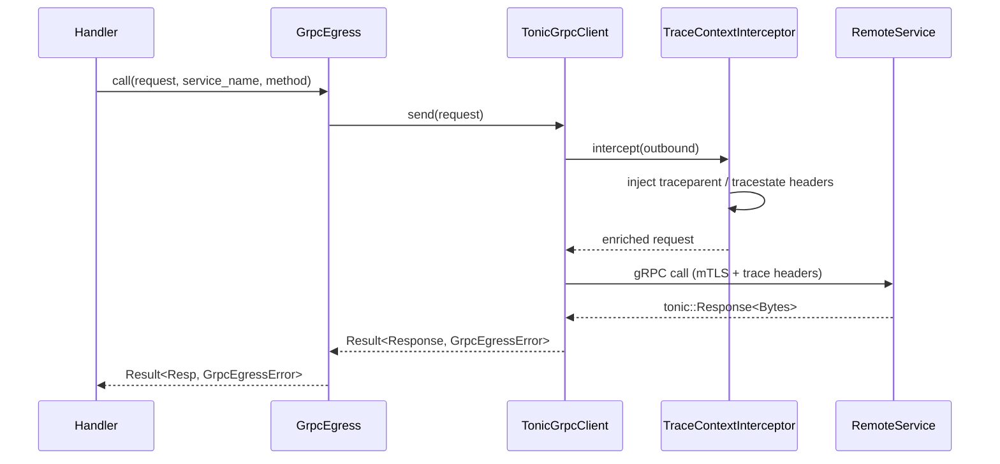
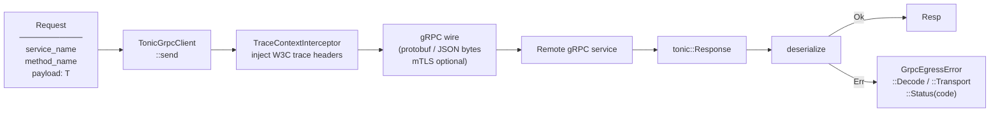

# Architecture — edge-transport-grpc-egress

## Sequence

> A domain handler uses `GrpcEgress` to call a downstream gRPC service; `TraceContextInterceptor` propagates the active span before the wire call.

## Data Flow

> A typed request enters `GrpcEgress`, is serialised, trace-enriched, and sent over gRPC; the response is deserialised back.

